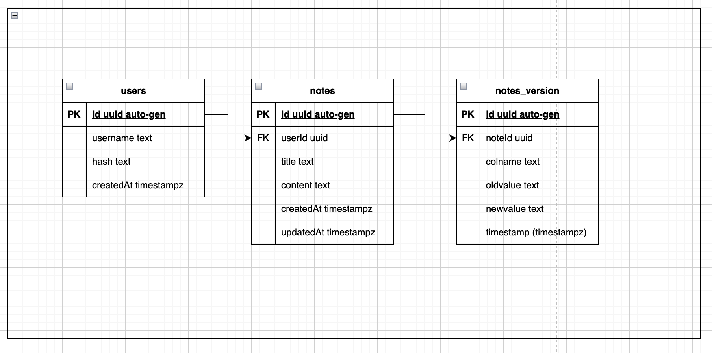
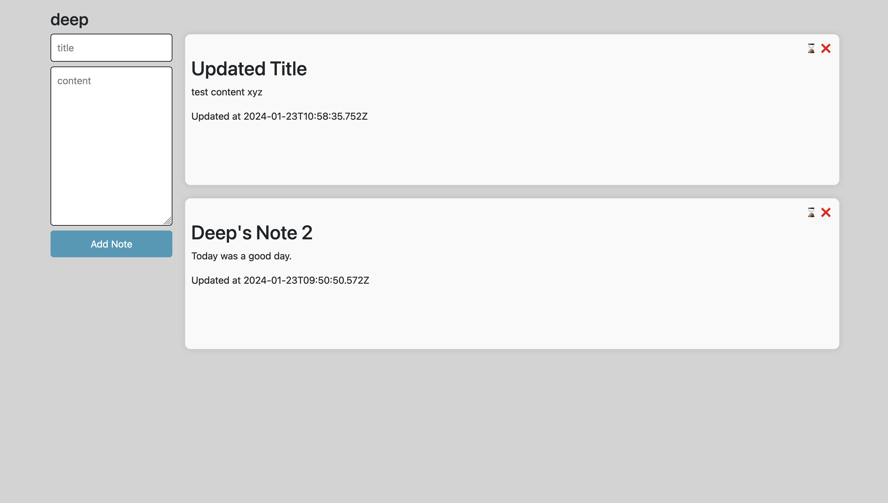
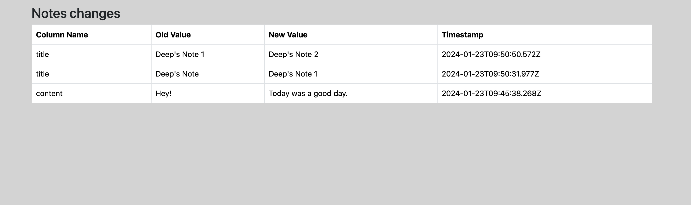

## Deep Bhatt - Note Taking App

<i><small>Made with ReactJS (Vite) and NodeJS/Express and PostgreSQL as datastore.</small></i>

## Project layout

- The project contains a backend API server which supports Authentication, Note CRUDs and Version control APIs.

- It also contains a frontend application made using ReactJS.

- I have attached a Docker compose file for easier setup of local instances of Postgres and pgadmin (an visual interface to interact with database during developement)

## Steps to start backend server

- cd to `application-server`
- copy `.env.copy` file to create a new `.env` file
- npm install
- npm run start
- the backend server should listen on `http://localhost:8080`by default
- port can be configured in `.env` file (Note: You'll have to reflect changes in ReactJS client's `.env` file as well)

## Steps to start frontend server

- cd to `notes-app-vite`
- copy `.env.copy` file to create a new `.env` file
- npm install
- npm run build
- npm run preview
- Frontend server should run on `http://localhost:4173/` by default

### Backend architecture and decisions

- Please read `features.txt`, it contains in-depth decisions about backend, and I make a case for why I made those decisions.

### Scaling backend application using PM2

We can use PM2 for starting a Node.js application, scaling it horizontally, and enabling load balancing.

```bash
# install pm2 globally
npm install pm2 -g

# spins up 4 servers processes and load balances automatically
# you can spin max processes equal to number of CPU cores. use option '-i max'
pm2 start src/index.js -i 4 --name application-server

# stop or delete all processes
pm2 stop|delete all

# kill all pm2 processes
pm2 kill
```

## App Screenshots

### Postgres database schema



### Login Form


### Register Form


### Dashboard



### Notes Version Control


